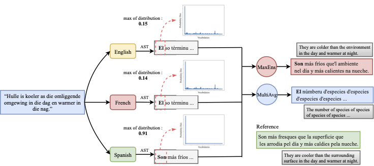

# Multi-Pivoting in Multilingual Machine Translation

[](#python)
[](https://arxiv.org/abs/2311.07439)
[](https://opensource.org/licenses/MIT) 

<p align="center">
  
</p>

This repository implements multi-pivoting methods for multilingual MT task, as described in [Mohammadshahi et al. (2023)](https://arxiv.org/abs/2311.07439).

In direct translation, the score of a translation $Y$ given a source sequence $X_{src}$ is computed as $s(Y;X_{src})$ = $\sum_{i} log p(y_i|y_{< i},X_{src})$ where $p(y_i|y_{< i},X)$ is the predicted probability of the $i$-th target token $y_i$ given the previous tokens $y_{< i}$ and the source sequence $X_{src}$.  

In multi-pivot setting, we select a set of pivots ($M=\{\mu_1,\mu_2,...,\mu_K\}$) and generate the their translations ($X_M=\{X_{\mu_1},X_{\mu_2},...,X_{\mu_K}\}$). The final translation is generated by ensembling predictions by the model, conditioned on the individual pivot translations. Here, we implement two approaches for such an ensembling:  

**Multilingual Averaging (MultiAvg)**: We average the predicted log-probabilities of a token $y_t$ across all pivot languages as $s(Y;X_M) = \sum_{i} \frac{1}{|M|}\sum_{k} log p(y_i|y_{< i},X_{\mu_k})$.

**Maximum Ensemble (MaxEns)**: This method biases the prediction towards the more confident pivot. MaxEns computes the combination as $s(Y;X_M) = \sum_{i} max_{k}[log p(y_i|y_{< i},X_{\mu_k})]$.

<p align="center">

</p>

## Installation

```
pip install -r requirements.txt
python -m unittest
```
## Dataset

It automatically downloads the required pair from ```https://huggingface.co/datasets/gsarti/flores_101```

## Usage

```
python -m scripts.run_inference --model_path MODEL --pivots TYPE --language_pairs af-ast --result_path PATH
MODEL: path to multilingual model
TYPE (ensembeling method):
- "direct" = direct translation
- "en" = pivoting English
- "top" = MaxEns method (add "--do_simple_avg" for MultiAvg method)
```
Supported models are:  
- [M2M-100 (418M)](https://huggingface.co/facebook/m2m100_418M). Use `--model_path m2m100_418M`
- [SMaLL-100](https://huggingface.co/alirezamsh/small100). Use `--model_path small100`


## Evaluation

Install sacreblue as:
```
git clone --single-branch --branch adding_spm_tokenized_bleu https://github.com/ngoyal2707/sacrebleu.git
cd sacrebleu
python setup.py install
```
Then:
```
sacrebleu ref.txt < pred.txt --tokenize spm
```
**Note**: [compute_chrf.py]() and [compute_no_hallucinations.py]() can be used to compute hallucinations. 

## Reference

```bibtex
@misc{mohammadshahi2023investigating,
    title={Investigating Multi-Pivot Ensembling with Massively Multilingual Machine Translation Models},
    author={Alireza Mohammadshahi and Jannis Vamvas and Rico Sennrich},
    year={2023},
    eprint={2311.07439},
    archivePrefix={arXiv},
    primaryClass={cs.CL}
}
```
